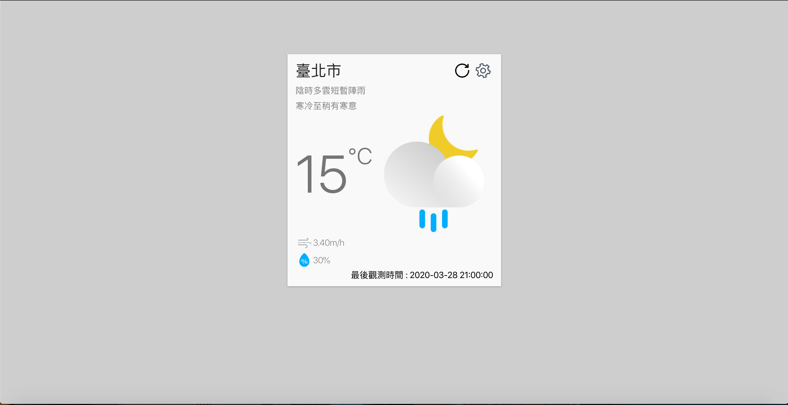
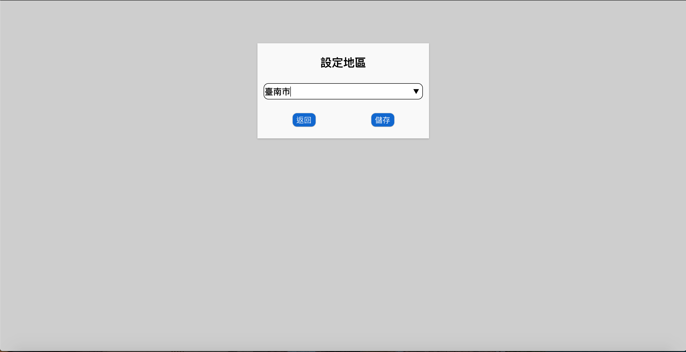
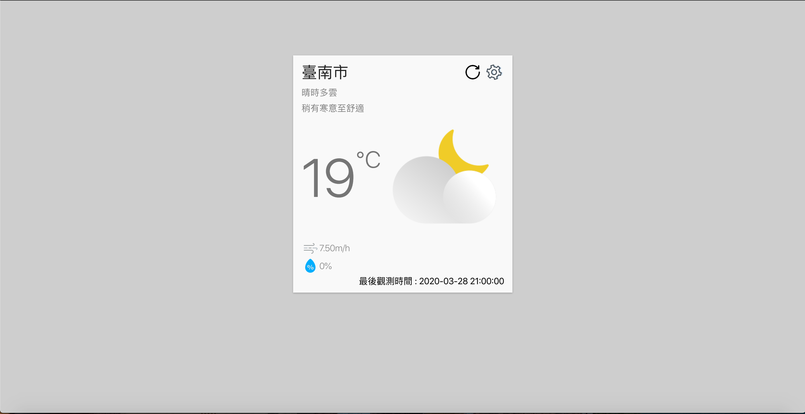

# About
This repository is my practice project about call the api from
[中央氣象局-資料開放平臺](https://opendata.cwb.gov.tw/dist/opendata-swagger.html)

# Screenshots

# Features
* choose a city
* displaying current weather's data

# Used technologies
* React / create-react-app
* React Hooks
* CSS Flexbox
